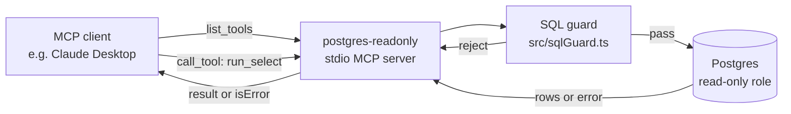

# Architecture

The cookbook is a flat collection of independent MCP server packages. There
is **no shared runtime code** — each server can be installed and read
top-to-bottom in isolation. That's deliberate (D-002): a cookbook should
let a reader copy one entry without dragging in five sibling abstractions.

```
mcp-server-cookbook/
├── servers/
│   ├── postgres-readonly/        ← shipped (this PR · issue #1)
│   ├── filesystem-sandbox/       ← pending issue #2
│   ├── api-with-auth/            ← pending (not yet filed)
│   └── internal-tools-bridge/    ← pending (not yet filed)
└── docs/
    └── architecture.md           ← you are here
```

Each server is its own npm workspace **without** an actual workspaces
declaration in a root `package.json`. Adding a workspaces root would couple
the servers' dep graphs (one server's TypeScript or Vitest version would
affect the others), which is the opposite of "cookbook". When/if a server
needs a sibling, that's an explicit cross-server import in its own
package.json — visible in code, not implicit through hoisting.

## Per-server invariants

Every server in `servers/<name>/` ships with this exact surface:

```
servers/<name>/
├── README.md                  ← starts with the threat model (D-003)
├── package.json
├── tsconfig.json
├── eslint.config.js
├── vitest.config.ts
├── src/
│   └── server.ts              ← MCP entry point (stdio transport)
├── test/
│   └── *.test.ts              ← hermetic tests for security-critical code
└── (optional) docker-compose.yml + sample-db/ or sample-data/
```

The runtime contract:
- **stdio transport.** Local-first; no network listening.
- **One process, one server.** The MCP server lives for one client
  conversation.
- **Per-call isolation where possible.** Database clients, filesystem
  handles, etc. are opened per tool call so the blast radius of leaked
  state stays one statement.

## How `postgres-readonly` fits the pattern



Three defense layers (D-004):

1. **DB-side.** The connection string points at a role with no write
   privileges. Bundled `sample-db/init.sql` creates `mcp_reader` granted
   only `SELECT` on `public`.
2. **Session-side.** Each query runs inside a session with
   `default_transaction_read_only = on`, so the engine refuses writes
   even if the role were mis-configured.
3. **Statement-side.** Every input to `run_select` passes through
   [`src/sqlGuard.ts`](../servers/postgres-readonly/src/sqlGuard.ts),
   which strips comments + string literals, splits on `;` while
   honoring quoted strings, requires the leading keyword be in a small
   allow-list, and rejects any forbidden keyword (every write/DDL verb,
   `pg_terminate_backend`, `pg_sleep`, `SET`, `RESET`, `LISTEN`, etc.).

The `WITH x AS (INSERT INTO ... RETURNING ...) SELECT * FROM x` bypass —
where the leading keyword is a benign `WITH` — is caught by the
forbidden-keyword scan, which is why the scan exists despite the
allow-listed leading keyword. The `INSERT` substring inside a string
literal (e.g. `SELECT 'INSERT INTO' AS msg`) is allowed because the scan
runs against a string-literal-stripped copy of the statement, not the
raw input.

## What's deliberately not in the cookbook

- **A "framework" for building MCP servers.** Servers in this repo don't
  inherit from a base class or share a server-loader. If a future entry
  needs the same boilerplate, the boilerplate is copied — not abstracted
  — until at least four entries demand the same shape.
- **Hosted MCP / network-reachable transports.** Local stdio only. Hosted
  MCP introduces auth, rate limiting, multi-tenancy, and observability
  concerns that pull a cookbook into framework territory.
- **A "registry" of available servers discoverable at runtime.** Servers
  are wired into clients (Claude Desktop, Claude Code, etc.) by config,
  one at a time.

## Pending entries (open issues)

- **`#2`** — `filesystem-sandbox` MCP server with allow-listed paths and
  explicit path-traversal rejection.
- *(unfiled)* — `api-with-auth` wrapping a SaaS tool with token-handling
  + scoped permissions.
- *(unfiled)* — `internal-tools-bridge` wrapping a small custom CLI.
