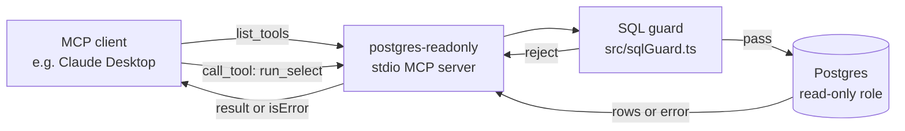

# Architecture

The cookbook is a flat collection of independent MCP server packages. There
is **no shared runtime code** — each server can be installed and read
top-to-bottom in isolation. That's deliberate (D-002): a cookbook should
let a reader copy one entry without dragging in five sibling abstractions.

```
mcp-server-cookbook/
├── servers/
│   ├── postgres-readonly/        ← read-only DB (#1, D-004)
│   ├── filesystem-sandbox/       ← allow-listed FS, TS (#2, D-005/D-006)
│   ├── filesystem-sandbox-py/    ← Python parity of filesystem-sandbox (#5)
│   ├── github-gists/             ← SaaS-API wrapper with token redaction (#3, D-007)
│   └── internal-tools-bridge/    ← in-repo CLI as MCP tool (#4, D-009)
└── docs/
    ├── architecture.md           ← you are here
    └── spec-version.md           ← canonical MCP SDK pin (D-008)
```

Each server is its own npm workspace **without** an actual workspaces
declaration in a root `package.json`. Adding a workspaces root would couple
the servers' dep graphs (one server's TypeScript or Vitest version would
affect the others), which is the opposite of "cookbook". When/if a server
needs a sibling, that's an explicit cross-server import in its own
package.json — visible in code, not implicit through hoisting.

## Per-server invariants

Every server in `servers/<name>/` ships with this exact surface:

```
servers/<name>/
├── README.md                  ← starts with the threat model (D-003)
├── package.json
├── tsconfig.json
├── eslint.config.js
├── vitest.config.ts
├── src/
│   └── server.ts              ← MCP entry point (stdio transport)
├── test/
│   └── *.test.ts              ← hermetic tests for security-critical code
└── (optional) docker-compose.yml + sample-db/ or sample-data/
```

The runtime contract:
- **stdio transport.** Local-first; no network listening.
- **One process, one server.** The MCP server lives for one client
  conversation.
- **Per-call isolation where possible.** Database clients, filesystem
  handles, etc. are opened per tool call so the blast radius of leaked
  state stays one statement.

The **configuration** contract, enforced across servers by two checkers
in `tools/` rather than by a shared module — each server is a
standalone copy-pasteable package, so the config readers cannot import
one another; they share a checked rule:

- **Numeric settings parse one grammar** (`check-numeric-env-grammar.mjs`,
  #152): trim, gate on `/^[+-]?\d+$/`, bound with `BigInt` against
  `MAX_SAFE_INTEGER`, then `Number`.
- **String settings honour one rule** (`check-string-env-grammar.mjs`,
  #157/#158): *a whitespace-only value is indistinguishable from the
  setting being absent.* Required settings throw for both; defaulted
  ones return the default for both. Stating it that way is what lets
  the check skip classifying settings as required or defaulted — the
  answer is the same either way, and a classification by source
  pattern would be a proxy that fails on correct code. Two of the seven
  real reads are trimmed a binding *downstream* of where they are read
  (`rawToken` → `token`, `raw` → `parts`), which is why the check
  traces bindings to a fixpoint rather than matching a statement.
  `postgres-readonly`'s `DATABASE_URL` was neither trimmed nor
  blank-checked, and `pg` stops parsing a space-padded value as a URL
  at all — one stray space connected to host `base` as the process's
  OS user.

- **Both ports of `filesystem-sandbox` read the same settings**
  (`check-config-port-parity.mjs`, #168). The two grammar checks above
  scan `.ts`, so the Python port is outside both — a scope they now
  *declare*, in named functions with a written reason, the way
  `check-boot-config-guard.mjs` already excluded it. That leaves one
  question nothing was answering: whether a setting exists in one port
  and not the other. The behavioural parity tests
  (`test_config_trim_parity.py` and its TS mirror) are thorough but
  enumerate the three settings *by hand*, so a fourth landing in one
  port only gets no coverage from them either. This pair has already
  had four divergences fixed by hand (#52, #98, #137, #139); the check
  compares the variable-name sets and nothing else, keyed on the name
  rather than on either language's access syntax — which is exactly
  what differs between them.

Both grammar populations are **discovered** from `servers/`, so a sixth
server inherits both rules without anyone remembering to add it to a
list. Within a file, the string check also asserts **coverage**: every
`env.NAME` access must be attributable to a read the matcher produced.
It only ever recognised a read *bound to a variable*, so four ordinary
spellings — a direct `return`, bracket access, an object literal, a
call argument — were not merely unchecked but uncounted, and the
`readers.length === 0` guard protects against the scan finding
*nothing* while being blind to it finding *less* (#168).

## How `postgres-readonly` fits the pattern


```mermaid
flowchart LR
  CLIENT[MCP client<br/>e.g. Claude Desktop]
  SERVER[postgres-readonly<br/>stdio MCP server]
  GUARD[SQL guard<br/>src/sqlGuard.ts]
  DB[(Postgres<br/>read-only role)]

  CLIENT -- list_tools --> SERVER
  CLIENT -- call_tool: run_select --> SERVER
  SERVER --> GUARD
  GUARD -- pass --> DB
  GUARD -- reject --> SERVER
  DB -- rows or error --> SERVER
  SERVER -- result or isError --> CLIENT
```

Three defense layers (D-004):

1. **DB-side.** The connection string points at a role with no write
   privileges. Bundled `sample-db/init.sql` creates `mcp_reader` granted
   only `SELECT` on `public`.
2. **Session-side.** Each query runs inside a session with
   `default_transaction_read_only = on`, so the engine refuses writes
   even if the role were mis-configured.
3. **Statement-side.** Every input to `run_select` passes through
   [`src/sqlGuard.ts`](../servers/postgres-readonly/src/sqlGuard.ts),
   which strips comments + string literals, splits on `;` while
   honoring quoted strings, requires the leading keyword be in a small
   allow-list, and rejects any forbidden keyword (every write/DDL verb,
   `pg_terminate_backend`, `pg_sleep`, `SET`, `RESET`, `LISTEN`, etc.).

The `WITH x AS (INSERT INTO ... RETURNING ...) SELECT * FROM x` bypass —
where the leading keyword is a benign `WITH` — is caught by the
forbidden-keyword scan, which is why the scan exists despite the
allow-listed leading keyword. The `INSERT` substring inside a string
literal (e.g. `SELECT 'INSERT INTO' AS msg`) is allowed because the scan
runs against a string-literal-stripped copy of the statement, not the
raw input.

## What's deliberately not in the cookbook

- **A "framework" for building MCP servers.** Servers in this repo don't
  inherit from a base class or share a server-loader. If a future entry
  needs the same boilerplate, the boilerplate is copied — not abstracted
  — until at least four entries demand the same shape.
- **Hosted MCP / network-reachable transports.** Local stdio only. Hosted
  MCP introduces auth, rate limiting, multi-tenancy, and observability
  concerns that pull a cookbook into framework territory.
- **A "registry" of available servers discoverable at runtime.** Servers
  are wired into clients (Claude Desktop, Claude Code, etc.) by config,
  one at a time.

## Shipped entries

All four cookbook patterns ship today; the Python parity port of the
filesystem sandbox is a fifth directory exercising the same threat
model from a second language ecosystem.

- **`servers/postgres-readonly/`** — read-only data access to Postgres.
  Three tools (`describe_schema`, `run_select`, `sample_rows`),
  defense-in-depth SQL guard (D-004). Closes #1.
- **`servers/filesystem-sandbox/`** — allow-listed filesystem access
  (TS). Three tools (`list_directory`, `read_file`, `write_file`),
  construction-time allow-list resolution (D-005), `realpath`-based
  symlink dereferencing (D-006). Closes #2.
- **`servers/github-gists/`** — API-wrapper-with-auth pattern over the
  GitHub Gists REST API. Two tools (`get_gist`, `update_gist_file`),
  token redaction at error boundaries (D-007). Closes #3.
- **`servers/internal-tools-bridge/`** — in-repo CLI exposed as a
  structured-args MCP tool. Shell-free `spawn` with binary allow-list,
  env passlist, output cap, per-call timeout (D-009). Closes #4.
- **Error-message parity (D-010).** `filesystem-sandbox` and
  `filesystem-sandbox-py` return byte-identical refusal strings,
  pinned by `test-fixtures/error_message_parity.json` — the fifth
  shared parity table, and the first covering a surface a client
  actually reads rather than an internal.
- **README test counts are runtime case counts (D-011, #166, #161).**
  `tools/check-readme.mjs` held every claim to a *static* count — test
  functions times a parametrize factor it can only sometimes resolve —
  while the README sentence annotates a **command**, and what a command
  prints is *cases*. All five claims were roughly half the truth (87 vs
  185, 132 vs 250, 98 vs 167, 49 vs 67, 190 vs 276), and the lock is why
  nobody noticed: it made each claim self-consistent with an
  approximation and froze it there. `tools/test-counts.json` now records
  the unit, and three checks hold it: the README comparison, a
  `static ≤ runtime` floor (a real invariant, so a hand-lowered entry
  cannot pass), and a per-server CI step that re-measures from the suite
  that job already runs. `tools/check-test-count.test.mjs` carries the
  wrong-unit rejection arm — the recorded count must be *strictly* above
  the static one, so swapping the number back fails loudly instead of
  being frozen again.
- **`servers/filesystem-sandbox-py/`** — Python parity port of
  `servers/filesystem-sandbox/` against the official `mcp` Python SDK.
  Same threat model, same primitive shape, dep-free security core.
  Closes #5.

## The two populations of the registration lock (#172)

`tools/` has no glob-based runner: every test and every checker is named
explicitly in `package.json` and in `.github/workflows/ci.yml`, so adding
one is two edits away from being a file nobody runs — the
`stuck-registration` fingerprint. `tools/check-tools-test-registration.test.mjs`
is the arm that catches it, over **two** populations: every
`*.test.mjs` must be named in CI, and every `check-*.mjs` must be too.

The two discoveries disagreed. The test scan recursed, and its comment
said exactly why — `#170` put a shared helper in `tools/lib/`, and a flat
`readdirSync` would not have seen its test at all, which is the
one-level-scan defect `#168` had just fixed in the string grammar
checker's own population. The checker scan, fifty lines below that
comment, was a flat `readdirSync` of `tools/` alone. Same file, same
directory, same hazard, opposite treatment, with the lesson stated in
prose above the place it was not applied.

Nothing was hidden by it: `tools/lib/` holds a helper rather than a
checker, and every entry point was wired. It is closed anyway because the
precedent for putting a file in `tools/lib/` is `#170` itself — the change
that added the lock — and this class has been paid for four times across
the portfolio.

Both discoveries now share one recursive walk parameterised by a filename
predicate, rather than two corrected copies: a second recursive walk beside
the first is the copy-instead-of-share shape `#170` fixed for
`stripComments`, and a suite cannot tell one definition from two identical
ones.

Three things the falsification established, and they are the reason the
arms are shaped as they are:

- A synthetic-tree test proves the *function* recurses and stays green when
  the *call site* is reverted to a flat scan. A predicate with no test of
  where it is called is one the next edit can orphan — so there is a
  separate call-site arm, and reverting the call site is red on that arm by
  name rather than incidentally on a call-count.
- The real `tools/` cannot prove recursion at all, because it contains no
  nested checker. That is precisely why the gap survived `#170`, and why
  the proof is over a fixture.
- The `check-` prefix is load-bearing, not decorative. Dropping it reports
  `tools/capture-demo.mjs` and `tools/lib/strip-comments.mjs` as unwired
  checkers — a demo recorder and a library, neither of which owes CI a step
  of its own while its test does.

### The third file, and why the walk moved to `tools/lib/` (#174, D-012)

`#172` and `#173` both pinned "one definition" *within*
`check-tools-test-registration.test.mjs`, where the walk was a private
function. Nothing asked the question across files — and
`tools/lib/strip-comments.test.mjs` went on scanning `tools/` one level
deep through both issues.

That file carries the arm "no tool declares its own stripComments", whose
own comment says only a structural arm catches the next re-paste. It saw
**27 of 29** `.mjs` files, and the two it missed were `tools/lib/`'s — so
**the arm had never once inspected the module it is about**. A re-paste
under `tools/lib/`, the directory `#170` created, was invisible to the one
arm written to catch a re-paste.

The walk is now `tools/lib/tools-files.mjs`, imported by both files. A
third copy was the alternative, and pasting one into the file that enforces
"do not re-paste the shared helper" is self-refuting.

Two things the fix had to get right, both measured rather than argued:

- **The canonical module is exempted by path.** A recursive walk sees
  `tools/lib/strip-comments.mjs` for the first time, and it genuinely does
  `export function stripComments`. Exempting by basename or by substring
  leaves the arm green while also forgiving a future
  `strip-comments-v2.mjs` — so the exemption's *source* is asserted, not
  just the constant it compares against. The first draft checked only the
  constant and both wrong spellings passed.
- **The separating arm is about the corpus, not the offenders.** Both hit
  sets are empty today, so no assertion on `offenders` can distinguish the
  flat walk from the recursive one. The scan records what it walked and
  asserts `tools/lib/` is in it; a first draft compared two lists it built
  itself and stayed green against the revert.
